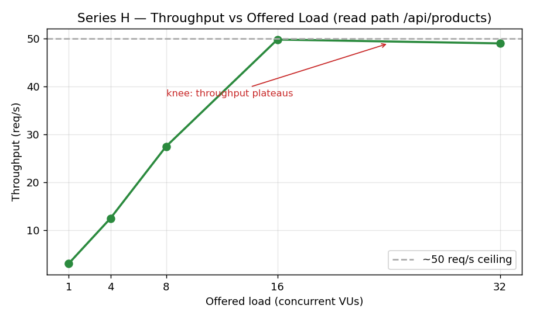
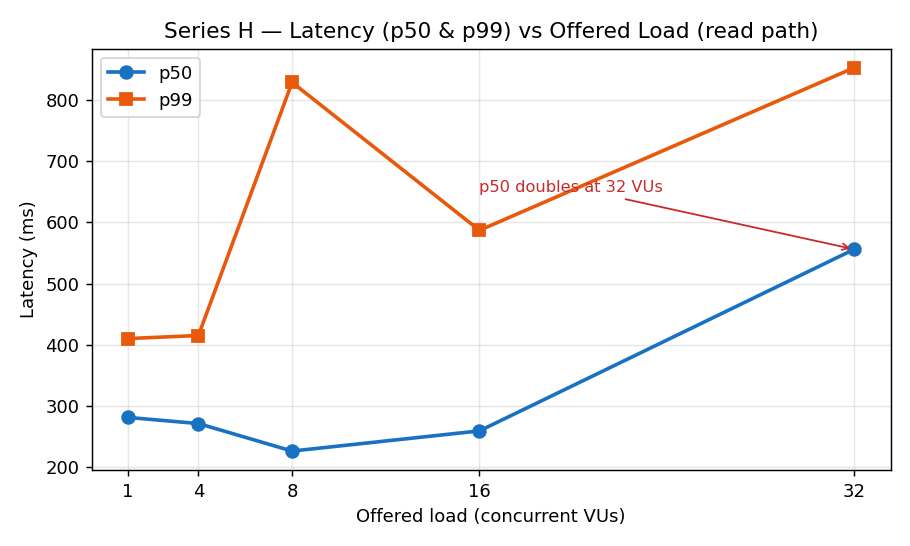
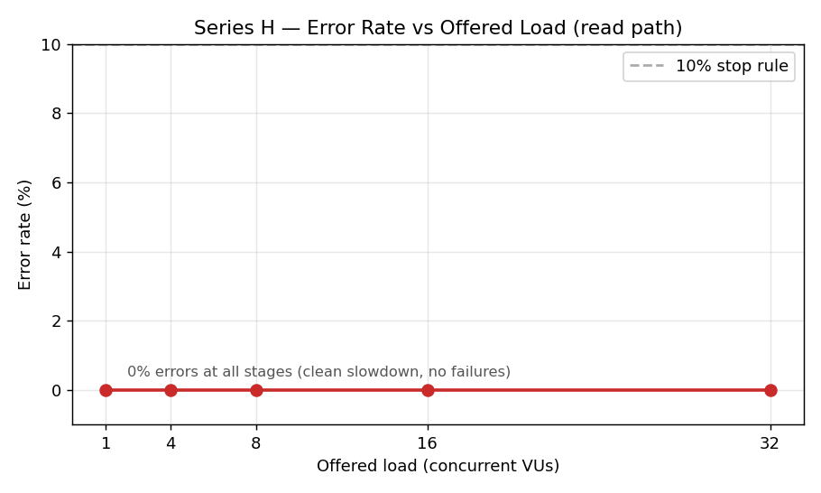
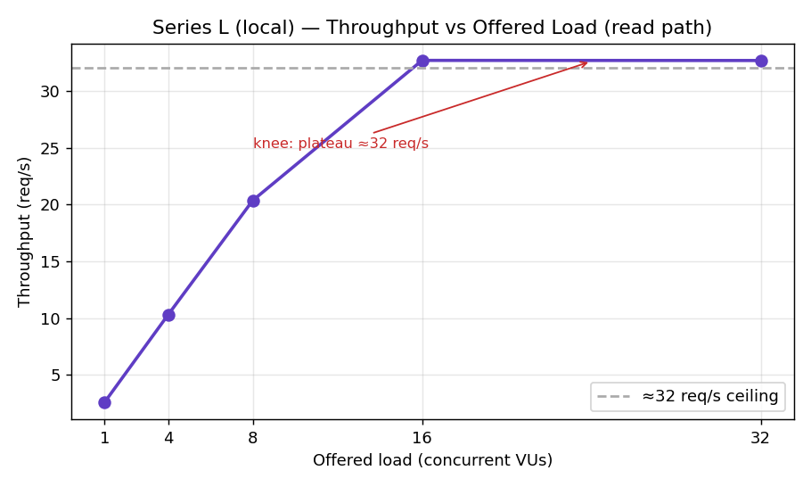
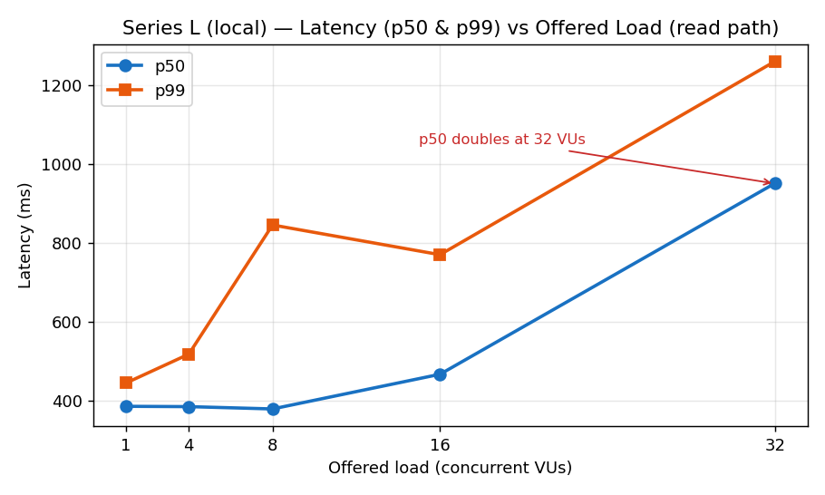
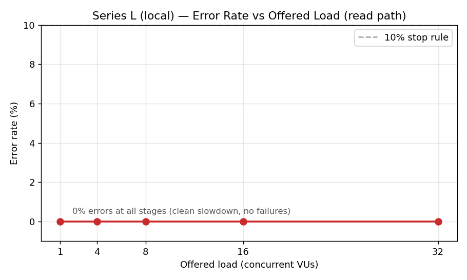

# M2 — Baseline Performance Report

**Project:** CSCE-500-Project — Mini Shop (Option B, e-commerce, video games)
**Public URL:** https://csce-500-project.onrender.com
**Repository:** https://github.com/chloemich04/CSCE-500-Project
**Team:** Sabri Kahoul (Series H — hosted), Chloe (Series L — local)
**Architecture (unchanged):** Browser / load generator → API → PostgreSQL

> This is a CSCE 553 class baseline, not a production system. All data is fake.

---

## 1. Capacity model (worksheet)

Filled in **before** any load test.

### Assumptions

| Param | Value | Source |
|-------|-------|--------|
| Active fraction | 10% | E-commerce DAU/MAU ≈8–10%. [Statsig](https://www.statsig.com/perspectives/understanding-daumau-key-metrics-for-product-success): "e-commerce sites average around 9.8%"; [CleverTap](https://clevertap.com/blog/dau-vs-mau-app-stickiness-metrics/): "E-commerce Apps: 10% DAU/MAU on average". |
| Requests/active user/hour | 5 | [MetricHQ](https://www.metrichq.org/marketing/page-views-per-session/): e-commerce 5–10 pages/session; we take 5 (lower bound), assume 1 session/user/peak-hour, 1 page ≈ 1 API request. |
| Read/write mix | 80 / 20 | Assignment. Reads = browse/search/view cart; writes = register/add-to-cart/checkout. |
| Bytes/response | 500 B | Measured: `GET /api/products` = 446 B, rounded to 500 B. Small catalog; a full catalog would be larger. |
| Copies | 1 | M1, no replication. |

### Formulas
```
Peak RPS    = active_users × req_per_user_per_hour / 3600
Write RPS   = Peak RPS × 0.20
Writes/day  = Write RPS × 86400
Storage/day = Writes/day × bytes_per_write × copies
Bandwidth   = Peak RPS × bytes_per_response × copies
```

### Worksheet

| Registered users | Active (10%) | Peak RPS | Write RPS | Writes/day | Storage/day | Bandwidth |
|------------------|--------------|----------|-----------|------------|-------------|-----------|
| 10 K | 1 K | 1.4 | 0.28 | 24 K | 12 MB | 0.69 KB/s |
| 1 M | 100 K | 139 | 28 | 2.4 M | 1.2 GB | 69 KB/s |
| 100 M | 10 M | 13,889 | 2,778 | 240 M | 120 GB | 6.9 MB/s |

*(Storage = raw new rows; indexes/WAL/backups add ≈2–4× on top, noted not modeled.)*

---

## 2. Predicted first limit (pre-measurement)

Architecture chain: Browser → **Render API (0.1 CPU)** → Supabase Postgres.

**Prediction:** the first limit to saturate is the **Render free-tier API CPU**. Under
concurrency, requests queue on that 0.1-CPU instance and p99 latency explodes before
Postgres hits its connection or CPU limits (the DB has more compute and the queries are
simple). Cold-start after idle dominates the first request.

*(Committed before the sweeps — see `prediction.md` / git history.)*

---

## 3. Method

- **Tool:** k6 v2.2.0 (open source), run from a local laptop.
- **Environments:**
  - **Series H (hosted):** API on the public Render URL, Postgres on Supabase (session pooler).
  - **Series L (local):** API on localhost (same code/commit), Postgres on the same hosted Supabase.
- **Endpoints:** control `GET /health`; read path `GET /api/products`; write path `PUT /api/cart/{item_id}` (update quantity — repeatable, unlike POST add-to-cart which accumulates and hits the stock limit); mix 80% read / 20% write.
- **Stages:** 1, 4, 8, 16, 32 concurrent VUs. Each read/write stage = 10 s warmup (discarded via a custom `measure_duration` metric) + 60 s measured, with 30–60 s drain between stages.
- **Stop rules:** error rate > 10%, or p99 > 5 s, or mostly 429/502/503. (Not triggered on the read path; the throughput plateau marked the capacity limit instead.)
- **Repeat:** the last healthy stage (16 VUs) was repeated to check stability.

---

## 4. Results — Series H (hosted)

### 4.1 Cold start (H only)
First `GET /health` after > 15 min idle: **≈32.25 s** (single request, wall time). Confirms cold-start dominates the first request on Render free tier.

### 4.2 Control — GET /health (warm, no DB)

| VUs | Throughput (req/s) | p50 | p95 | p99 | max | Errors |
|-----|--------------------|-----|-----|-----|-----|--------|
| 1 | 13.9 | 69.71 ms | 80.94 ms | 99.32 ms | 115.35 ms | 0% |
| 4 | 55.7 | 69.18 ms | 77.91 ms | 120.55 ms | 139.26 ms | 0% |
| 8 | 114.4 | 67.33 ms | 77.14 ms | 109.51 ms | 160.45 ms | 0% |
| 16 | 224.1 | 68.74 ms | 78.40 ms | 99.14 ms | 149.07 ms | 0% |

Throughput scales linearly, latency flat, 0% errors — `/health` does no real work, so it does not saturate. Baseline/control.

### 4.3 Read path — GET /api/products (main saturation sweep)

| VUs | Throughput (req/s) | p50 | p95 | p99 | max | Errors |
|-----|--------------------|-----|-----|-----|-----|--------|
| 1 | 3.07 | 281 ms | 376 ms | 410 ms | 430 ms | 0% |
| 4 | 12.5 | 271 ms | 315 ms | 415 ms | 444 ms | 0% |
| 8 | 27.5 | 226 ms | 308 ms | 829 ms | 1.66 s | 0% |
| **16** | **49.8** | **259 ms** | **352 ms** | **587 ms** | **802 ms** | **0%** |
| **32** | **49.0** | **556 ms** | **700 ms** | **853 ms** | **1.18 s** | **0%** |
| 16 (repeat) | 49.5 | 259 ms | 354 ms | 592 ms | 805 ms | 0% |

**Knee between 16 and 32 VUs:** throughput plateaus at ≈50 req/s (49.8 → 49.0, stops scaling) while p50 doubles (259 → 556 ms). The 16-VU repeat agrees closely (49.8 vs 49.5 req/s; p99 587 vs 592 ms) → stable measurements.

### 4.4 Write path — PUT /api/cart/{item_id}

| VUs | Throughput (req/s) | p50 | p95 | p99 | max | Errors |
|-----|--------------------|-----|-----|-----|-----|--------|
| 8 | 9.6 | 708 ms | 916 ms | 1.02 s | 1.05 s | 0% |
| 16 | 15.8 | 853 ms | 1.11 s | 1.20 s | 1.51 s | 0% |

Read vs write at 16 VUs: read 49.8 req/s / p50 259 ms vs write 15.8 req/s / p50 853 ms. Writes are ≈3× slower and ≈3× lower throughput (UPDATE + commit costs more than a read) — the write path saturates earlier.

### 4.5 Mix — 80% read / 20% write @ 16 VUs

| Test @ 16 VUs | Throughput (req/s) | p50 | p95 | p99 | Errors |
|---------------|--------------------|-----|-----|-----|--------|
| Read pure | 49.8 | 259 ms | 352 ms | 587 ms | 0% |
| **Mix 80/20** | **35.2** | **294 ms** | **898 ms** | **999 ms** | **0%** |
| Write pure | 15.8 | 853 ms | 1.11 s | 1.20 s | 0% |

The mix p50 stays near read (294 ms), but p95/p99 (898/999 ms) approach the write path even though only 20% of requests are writes: slow writes occupy the single CPU and block fast reads queued behind them. A minority of writes limits the tail for everyone — *mix changes the bottleneck.*

---

## 5. Results — Series L (local)  *[CHLOE TO FILL]*

> Same code/commit, API on localhost, same hosted Supabase. Local CPU is visible here — this is the direct CPU evidence the hosted side cannot show.

### 5.1 Control — GET /health (local)

| VUs | Throughput (req/s) | p50 | p95 | p99 | max | Errors |
|-----|--------------------|-----|-----|-----|-----|--------|
| 2 | 201.4 | 13.64 ms | 20.53 ms | 27.14 ms | 106.01 ms | 0% |

*(from `L-health-c2.requests.csv`. Local /health is far faster than hosted — 13.6 ms p50 vs 70 ms — because there is no laptop→cloud network hop for the API itself.)*

### 5.2 Read path — GET /api/products (local)

| VUs | Throughput (req/s) | p50 | p95 | p99 | max | Errors |
|-----|--------------------|-----|-----|-----|-----|--------|
| 1 | 2.58 | 386.08 ms | 406.19 ms | 445.22 ms | 487.93 ms | 0% |
| 4 | 10.28 | 385.28 ms | 402.95 ms | 518.39 ms | 854.98 ms | 0% |
| 8 | 20.35 | 379.43 ms | 405.71 ms | 845.95 ms | 1235.66 ms | 0% |
| 16 | 32.68 | 467.35 ms | 595.38 ms | 770.59 ms | 914.34 ms | 0% |
| 32 | 32.67 | 951.53 ms | 1130.84 ms | 1260.84 ms | 1856.03 ms | 0% |
| 16 (repeat) | 32.77 | 472.77 ms | 560.95 ms | 706.88 ms | 961.95 ms | 0% |

*(from `L-read-c1/c4/c8/c16/c32.requests.csv` and `L-read-c16-repeat.requests.csv`. Same knee pattern as Series H: throughput plateaus at ≈32 req/s from 16→32 VUs (32.68 → 32.67, stops scaling) while p50 doubles (467→952 ms). The 16-VU repeat agrees within 0.26% (32.68 vs 32.77 req/s) → stable. Note local read latency (≈385 ms p50 at low load) is higher than hosted (≈281 ms) — the local API still queries the same remote Supabase, so the DB round-trip dominates and the API compute, not the network, sets the ceiling.)*

### 5.3 Write path — PUT /api/cart (local)

| VUs | Throughput (req/s) | p50 | p95 | p99 | max | Errors |
|-----|--------------------|-----|-----|-----|-----|--------|
| 16 | 10.75 | 1405.19 ms | 1754.66 ms | 2211.65 ms | 2662.87 ms | 0% |

*(from `L-write-c16-valid.requests.csv`. Write is much heavier than read at 16 VUs: 10.7 vs 32.7 req/s, p50 1405 vs 467 ms. Correctness note: the final cart quantity rose far less than the number of successful writes — concurrent read-modify-write updates overwrote each other (lost updates). HTTP 200 did not guarantee every increment persisted; this is a concurrency-correctness observation, not a capacity error.)*

### 5.4 Mix 80/20 (local)

| Test @ 16 VUs | Throughput (req/s) | p50 | p95 | p99 | Errors |
|---------------|--------------------|-----|-----|-----|--------|
| Read pure | 32.68 | 467 ms | 595 ms | 771 ms | 0% |
| Mix 80/20 | 23.14 | 486 ms | 1388 ms | 1544 ms | 0% |
| Write pure | 10.75 | 1405 ms | 1755 ms | 2212 ms | 0% |

*(from `L-mix-c16.requests.csv`. Same effect as Series H: the mix p50 stays near read (486 ms) but p95/p99 (1388/1544 ms) jump toward the write path, even though only ≈20% are writes — the writes inflate the tail for everyone.)*

### 5.5 Local CPU and DB (resource signals — direct)
Captured during the read sweep (screenshots `local-L-idle-*.png`, `local-L-read-c4/c8/c16/c32-*.png` in `m2/results/`). Git commit `bd1072a`; local API `python -m uvicorn app.main:app` (PID varies), Python 3.14.7, Windows laptop on AC power. Timezone CDT (UTC−05:00).

| Stage | API CPU | API memory (working set) | DB connections (total) |
|-------|---------|--------------------------|------------------------|
| Idle baseline | 0% | ≈47.7 MB | 15 |
| read c4 | 1% | ≈51.6 MB | 21 |
| read c8 | 1% | ≈57.9 MB | 26 |
| read c16 | 2% | ≈122.5 MB | 28 |
| read c16 (repeat) | 2% | ≈122.6 MB | 28 |

**Reading:** the local API CPU stays low (0→2%) and the DB connections stay modest (15→28 of 60) even as throughput plateaus at ≈32 req/s. Memory grows with concurrency (48→122 MB) but never approaches a limit. On a single-worker local process the ceiling is per-request serialization through the API (each request waits on the remote Supabase round-trip), not raw CPU or DB — consistent with the hosted bottleneck being the constrained 0.1-CPU compute on Render. **Dataset:** 50 products, `GET /api/products` = 8,515 bytes.

---

## 6. Figures

All figures are in `m2/results/`. Series H and Series L are plotted separately (never merged).

**Series H (hosted) — read path:**





- `fig1_H_throughput.png` — throughput vs offered load (plateau at ≈50 req/s).
- `fig2_H_latency.png` — p50 & p99 vs offered load (p50 doubles at 32 VUs).
- `fig3_H_errorrate.png` — error rate vs offered load (0% at all stages).

**Series L (local) — read path:**





- `fig4_L_throughput.png` — throughput vs offered load (plateau at ≈32 req/s).
- `fig5_L_latency.png` — p50 & p99 vs offered load (p50 doubles at 32 VUs).
- `fig6_L_errorrate.png` — error rate vs offered load (0% at all stages).

Both series show the same shape (throughput plateau + latency doubling at the knee, 0% errors), on different absolute ceilings (H ≈50 req/s, L ≈32 req/s).

---

## 7. Resource signals (aligned in time with the sweeps)

**Series H (hosted).** Render free tier does not expose API CPU/memory (paywalled; upgrading forbidden). Signals used:

| Signal | Value during load | Reading |
|--------|-------------------|---------|
| Supabase DB CPU | ≈2% | DB idle — not the bottleneck |
| Supabase peak connections | 14 / 60 | Ample headroom (23% of limit) |
| Supabase disk IO | ≈1% | No disk pressure |
| Render outbound bandwidth | rising during runs | Service actively serving load |

**Series L (local):** direct local CPU screenshots (section 5.5) — the compute signal the hosted side cannot provide.

Screenshots and timestamps in `m2/results/`.

---

## 8. Bottleneck claim

**Bottleneck: Render free-tier API compute (0.1 CPU).** Two signals move together:
1. Read-path throughput plateaus at ≈50 req/s from 16→32 VUs while p50 doubles (259→556 ms) at 0% errors — the signature of a compute queue, not failures; the write path saturates even earlier.
2. During the same runs, Supabase is at 2% CPU, 14/60 connections, 1% disk IO — the DB has ample headroom.

By elimination in the Browser→Render→Postgres chain, the Render API compute is the limit. Series L confirms this directly: local CPU rises with load while the (shared) DB stays idle. This matches the pre-measurement prediction.

---

## 9. Proposed SLO

**Eligible events:** warm `GET /api/products` after login, excluding cold-start.

**SLO:** *99% of eligible events complete within 900 ms, with error rate ≤ 1%, over the lab window.*

**Basis:** at the last healthy stage (16 VUs) measured p99 = 587 ms at 0% errors; at 32 VUs p99 = 853 ms, still 0% errors. 900 ms leaves headroom above the healthy p99 while failing if pushed further.

**Does H meet it?**
- 16 VUs (healthy): p99 587 ms ≤ 900 ms, 0% errors → **PASS**.
- 32 VUs (saturated): p99 853 ms ≤ 900 ms, 0% errors → **PASS** on pure reads, but throughput no longer scales.
- Mix 80/20 @ 16 VUs: p99 999 ms > 900 ms → **FAIL**. Realistic mixed traffic breaches the SLO because the 20% writes inflate the tail.

**Conclusion:** H meets the SLO for pure warm reads up to its ≈50 req/s ceiling, but a realistic read/write mix breaches it. The binding limit is the tail under mixed load.

---

## 10. Gap: predicted vs measured, and revised model

**Predicted:** Render 0.1-CPU API is the first limit; DB keeps headroom; cold-start dominates the first request.

**Measured:** confirmed. Read throughput plateaus at ≈50 req/s while p50 doubles, 0% errors; Supabase idle (2% CPU, 14/60 connections); cold-start ≈32 s. Right bottleneck. One refinement: the *write path and mix* degrade the tail earlier than the pure read sweep suggests, so the read-only knee (≈50 req/s) overstates real capacity.

**Revised model:**
- **10K users (≈1.4 predicted RPS):** ≈35× below the measured ≈50 req/s read ceiling → ample headroom, not compute-bound on this architecture.
- **1M users (≈139 RPS):** ≈3× above the measured ceiling → needs more than one 0.1-CPU instance (horizontal scaling / larger tier). DB still not the first thing to change.
- **100M users (≈13,900 RPS):** ≈280× the ceiling → requires many API replicas behind a load balancer, a read-path cache, and DB read replicas/partitioning — the architecture must change (out of scope for M1/M2).

**Revised first-limit statement:** the Render 0.1-CPU API compute caps sustained read throughput at ≈50 req/s and mixed-traffic p99 near 1 s, well before Postgres shows any pressure.

---

## 11. Confounds

- Render free tier: 0.1 CPU, sleeps after ≈15 min idle (cold start measured separately: 32 s).
- No direct Render CPU/memory metric (paywalled) — inferred from DB headroom + throughput plateau on H; Series L exposes CPU directly.
- Local laptop as load generator; network path to us-west Supabase included in hosted latency.
- Series H and Series L are reported in separate tables and never averaged together.
- **Response-size difference between series:** the capacity worksheet uses ≈500 B (measured on H with a near-empty catalog: 446 B). Series L was run with 50 products, where `GET /api/products` = 8,515 bytes. This does not change the bottleneck (compute/serialization, not bandwidth), but bandwidth figures scale with catalog size; the worksheet's storage/bandwidth numbers are lower bounds for a small catalog.
- **Shared free-tier neighbors:** on Render/Supabase free tiers the instance shares physical hardware with other tenants; their spikes can perturb our latency (especially the p99 tail) independently of our own load.
- **Clock skew:** the load generator (laptop) and the hosted servers do not share a clock; small offsets can affect absolute timestamps when aligning k6 runs with the resource-signal screenshots. We align by wall-clock window (≈Sep 7, 2–3 pm), not exact millisecond timestamps.
- Exploratory `/health` stages ran ≈10 s; read/write/mix stages used the full 10 s warmup + 60 s measured protocol.

---

## 12. Reproducibility

- Endpoints and demo accounts: see the M1 README API table (`alex@example.com` / `blair@example.com` / `casey@example.com`, password `ClassDemo123!`).
- k6 scripts in `m2/` (`health-test.js`, read/write/mix variants); request bodies in `m2/requests/`.
- Raw CSVs in `m2/results/` (Series H: `series_h_results.csv`; Series L: `L-*.requests.csv`, `local-summary.csv`).
- Each stage: 10 s warmup discarded + 60 s measured; wake the app via `/health` before hosted runs (free-tier cold start ≈1 min).
